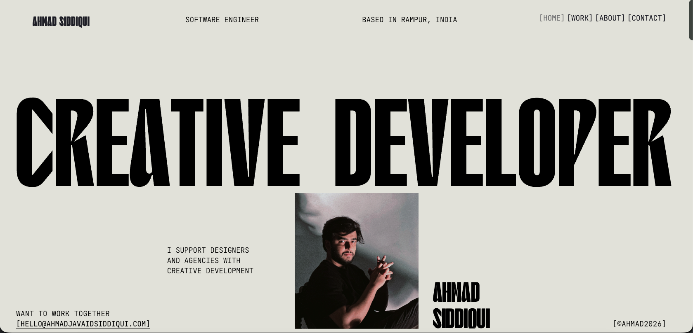

# Ahmad Siddiqui — Portfolio

Personal portfolio site. Originally a static HTML/CSS/JS build, ported to a Vite + React SPA with GSAP-driven animations and Lenis smooth scroll. The original CSS rules and responsive breakpoints (`@media (max-width: 768px)` and `(max-width: 1166px)`) are preserved verbatim, so the layout and animation timings match the original 1:1.

**Live:** https://ahmadsiddiqui-dev.github.io/Portfolio/



## Stack

- **Vite** — build tool & dev server
- **React 18** + **React Router** — SPA routing
- **GSAP** + **ScrollTrigger** — reveal, parallax, and scroll-linked animations
- **Lenis** — smooth scroll, hooked into GSAP's ticker so scroll-linked animations stay in sync
- **@react-three/fiber** + **drei** — 3D hobby models on the About page
- **gh-pages** — deploy

## Features

- Full-screen preloader with percent counter (plays once per session)
- Page-to-page fade transitions matched to each route's background color
- Custom "CLICK ME" cursor on email blocks
- Letter-by-letter heading reveals (CREATIVE / DEVELOPER blur reveal)
- Infinite-loop hobby slider on About (GYM / MUSIC / TRAVELLING)
- iOS-specific font rendering tweaks (text-stroke + TT-WOFF2 fallback for CFF font issues)
- Open Graph + Twitter Card meta for rich link previews

## Pages

| Route          | Component       | Notes                                        |
| -------------- | --------------- | -------------------------------------------- |
| `/`            | `Home`          | Hero + preloader                             |
| `/work`        | `Work`          | Project list                                 |
| `/about`       | `About`         | Bio, hobby slider, accordion services        |
| `/contact`     | `Contact`       | Dark theme; email + socials                  |
| `/projectpage` | `ProjectPage`   | Case study layout                            |
| `/mobilemenu`  | `MobileMenu`    | Full-screen nav                              |

## Run locally

```bash
npm install
npm run dev       # http://localhost:5173
npm run build     # production build → dist/
npm run preview   # preview the built site
```

## Deploy

Deployed to GitHub Pages from the `dist/` folder:

```bash
npm run deploy
```

The Vite `base` is set to `/Portfolio/` because the site is served from `ahmadsiddiqui-dev.github.io/Portfolio/`. Update `vite.config.js` if you fork this to a different repo path.

## Project structure

```
src/
  components/      # Header, Footer, Preloader, SmoothScroll, PageTransition,
                   # CustomCursor, TLink, Accordion, HeadingSlider, MenuOverlay
  pages/           # Home, Work, About, Contact, ProjectPage, MobileMenu
  hooks/
    useRevealAnimations.js    # GSAP + ScrollTrigger setup shared by all pages
  styles/
    css.css        # Base + desktop
    css2.css       # About-only extras
    padcss.css     # Tablet (≤1166px)
    mblcss.css     # Mobile (≤768px)
    design-system.css  # Updated typography + per-page overrides
  App.jsx          # Provider stack: SmoothScroll → PageTransition → Routes
  main.jsx         # Imports stylesheets in original load order

public/            # Images, favicon, fonts, OG share image
```

## Credits

- Type: **T1 Korium** (display), **JetBrains Mono** (mono), **PP Neue Montreal** (body)
- Smooth scroll: [Lenis](https://github.com/darkroomengineering/lenis)
- Animations: [GSAP](https://gsap.com/)

---

© Ahmad Siddiqui 2026
